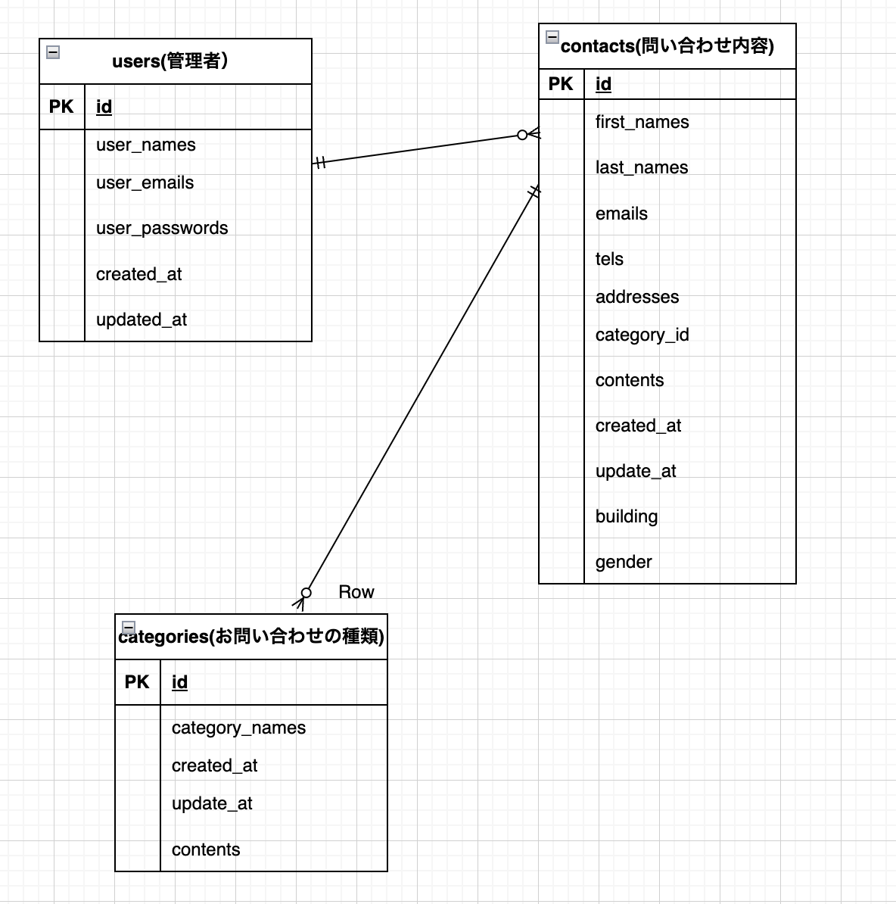

# FashionablyLate お問合せフォーム

### 前提条件
-php 8.1
-laravel 8.83.8
- MySQL  15.1


### ER図

Markdown プレビューを表示して下さい

右クリックして「Markdown: Open Preview」または「Markdown: Open Preview to the Side」を選択します。

または、Ctrl + Shift + V（Windows/Linux）や Cmd + Shift + V（Mac）でプレビューを表示できます。

### 環境構築
Dockerビルド
1. リポジトリをクローン
    git clone git@github.com:e-pig/contact_form2.git
    cd contact_form2

2. ローカル環境の作成
    docker compose up -d --build

MySQLはOSによって起動しない場合があるのでそれぞれのPCに合わせて、docker-compose.ymlを編集して下さい。

Larevel環境構築
1.コンテナに入る
    docker compose exec php bash

2. パッケージをインストール
    composer install

3. `.env`ファイルの作成
    cp .env.example .env

4. アプリケーションキーの生成
    ```bash
    php artisan key:generate


注：多数のエラーが続いており、全て終わりませんでした。
/register /login /admin　は上記設定をしていただくと確認できますがほぼエラーになると思われます。シーダファイルの作成にも至っていません。